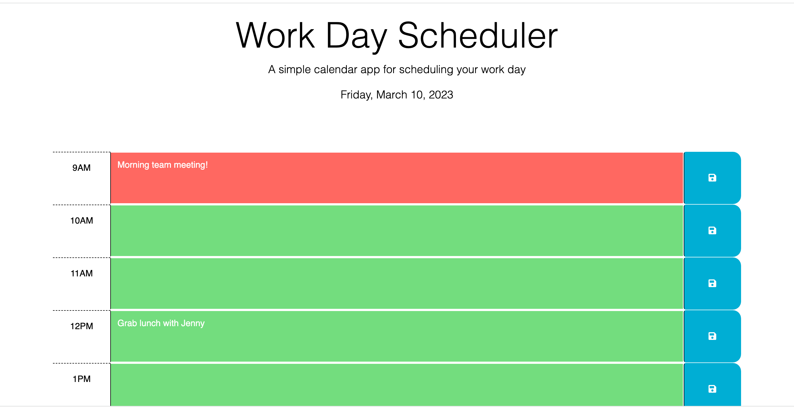
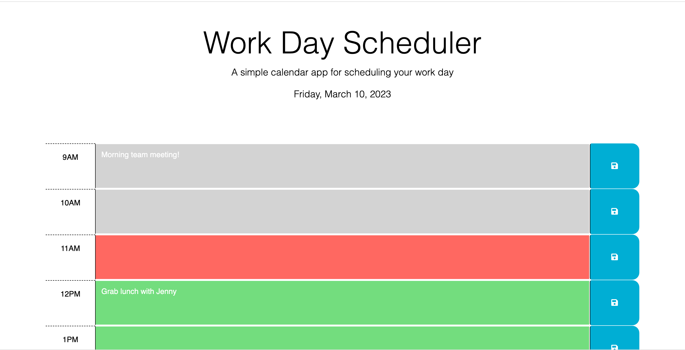

# 05 Third-Party APIs: Work Day Scheduler

Deployment: https://snastacia.github.io/Work-Day-Scheduler-Third-Party-API-Challenge/

## Description

A simple and easy to use calendar application that allows a user to save events for each hour of the day. This app runs in the browser and features a dynamically updated HTML and CSS that is powered by jQuery.

## User Story

AS AN employee with a busy schedule
I WANT to add important events to a daily planner
SO THAT I can manage my time effectively

## Acceptance Criteria

GIVEN I am using a daily planner to create a schedule
WHEN I open the planner
THEN the current day is displayed at the top of the calendar
WHEN I scroll down
THEN I am presented with timeblocks for standard business hours
WHEN I view the timeblocks for that day
THEN each timeblock is color coded to indicate whether it is in the past, present, or future
WHEN I click into a timeblock
THEN I can enter an event
WHEN I click the save button for that timeblock
THEN the text for that event is saved in local storage
WHEN I refresh the page
THEN the saved events persist

## Installation

No installation required

## Usage

When a user open the Work Day Scheduler in their browser, they'll be presented with a schedule that includes the current dat e at the top of the webpage. 

The schedule will display time blocks for a typical 9am - 5 pm work day, and the user will be able to enter and save notes in their desired time blocks. 

When a time block in the scheduler matches the present time the block's background color will change to red. When a time block has yet to happen (future time), the block's background color will be green. Lastly, if a time block has already passed, the block's background color will change to gray. 

Example of present and future time blocks with date at the top: 

Example of past time blocks: 

## Credits

JavaScript code was written with the assitance of tutor, Katherine Redford. 

## License

N/A
